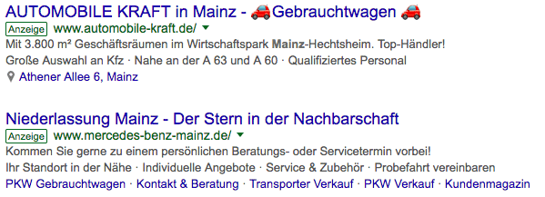

# emoji-in-adwords
*We'll see emojis in Google Shopping.*

As we know, Google surprise us every day with your technology and new improvements, making the possibilities a new way to communication.

##Emoji in Adwords

About two weeks ago I saw a reply on #twitter that shows a screen showt of emojis, showing up in Google Adwords Ads (in Germany) for a query about Automobile. 

You can see the print here:

**This might be a bug or a loophole? Have you ever seen emojis in Google Adwords recently?**

I think Google is the best place to show your brand to the world, so, since we all like emojis, this is the best new way to draw attention.

When I get the chance, i'll try. But... i'm not sure if this functionality has already able to be implemented in Brazil.

:shipit:

